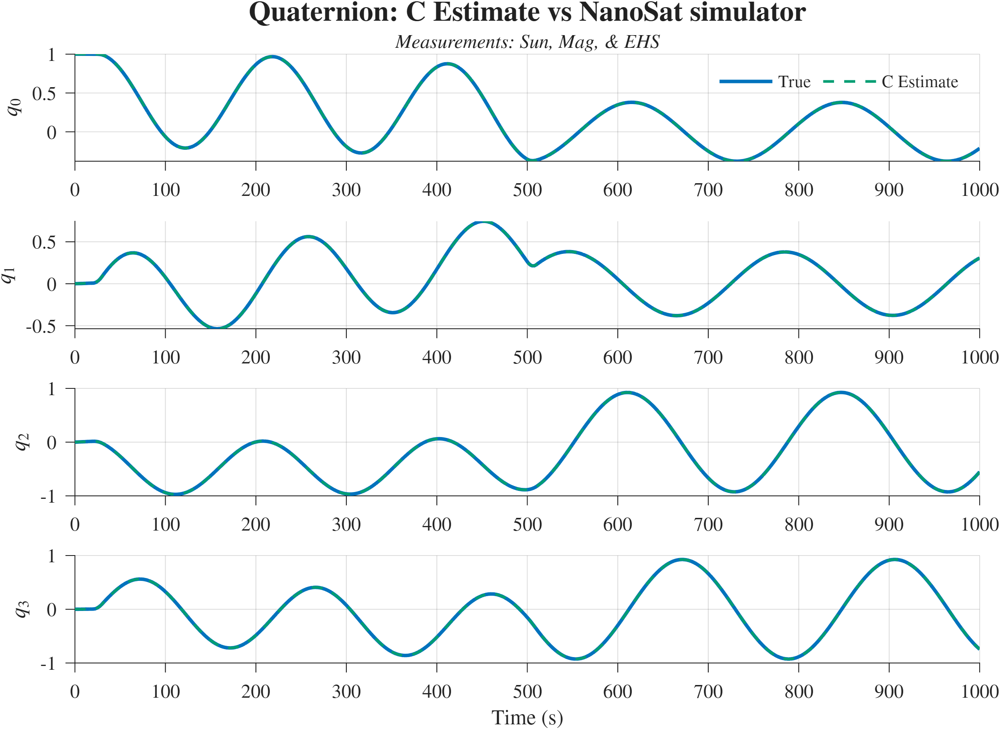
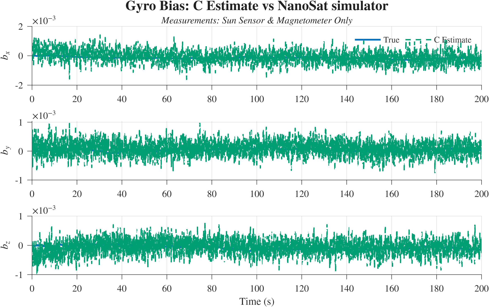
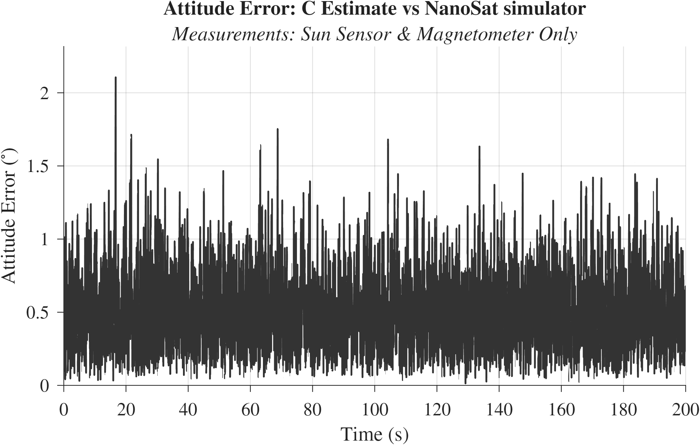
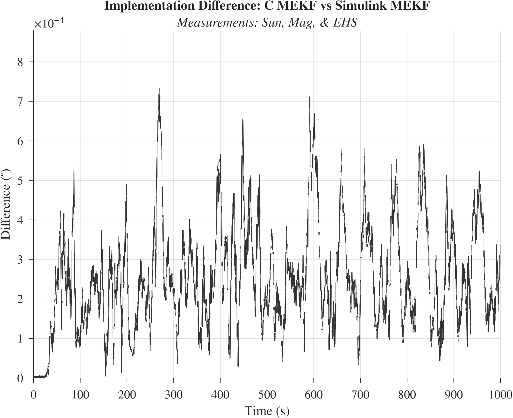

# NanoSat MEKF Attitude Estimator 🛰️

A C implementation of a Multiplicative Extended Kalman Filter (MEKF) for NanoSat attitude determination.

Designed for modern ARM Cortex-M microcontrollers with Hardware Floating-Point Units (like the **STM32 F7 and H7 series**), this project adapts double-precision simulation algorithms for 32-bit single-precision embedded environments.

## 🚀 Key Features

*   **Sensor Fusion:** Couples gyroscope rate integration with vector measurements from a **Sun Sensor and Magnetometer**.
*   **Joseph Form Covariance:** Maintains a positive semi-definite $P$ matrix to help mitigate 32-bit float truncation errors over time.
*   **Memory Efficiency:** Uses a ~6 KB stack footprint with flattened 1D arrays, avoiding dynamic memory allocation.

---

## 📊 Validation & Performance

This filter was tested against a MATLAB/Simulink NanoSat Simulator. The embedded C implementation closely matches the numerical performance of the double-precision Simulink reference model.

### 1. Attitude Tracking
Tracks the simulated true state across all four quaternion components.

### 2. Gyro Bias Estimation
Estimates and removes gyroscope biases using the vector measurements for drift correction.

### 3. Absolute Attitude Error
Shows the physical pointing error of the C implementation compared to the simulation environment.

### 4. Implementation Accuracy (C vs. Simulink)
Compares the C code output directly against the Simulink MEKF. The Principal Rotation Angle difference stays around **~0.0001 degrees**, showing strong numerical agreement.

---

## 💻 Hardware Integration Notes

*   **FPU Requirement:** Ensure your compiler flags have hardware floating-point math enabled. Emulated floating-point math will noticeably impact execution speed.
*   **Sample Rates:** The filter structure assumes a higher frequency prediction step (Gyro) and a lower frequency innovation step (Sun/Mag). Ensure the `dt` parameter is updated in your hardware timer interrupts to handle multi-rate sensors.

## 📁 File Structure

*   `mekf_wb.c` / `mekf_wb.h` - Core filter logic and math operations.
*   `main.c` - Example test wrapper for processing `.csv` telemetry.
